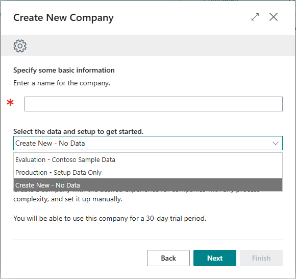
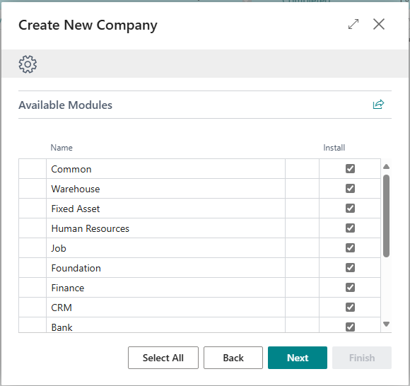

# Contoso Coffee Demo Data Set
Contoso Coffee is a fictional company that manufactures consumer and commercial coffee makers. The Contoso Coffee apps for Business Central provide demo data that you can use to learn and explore the capabilities of Business Central.
# Old Demo Data
Old demo data were shipped as rapidstart packages:
- **Setup**: Setup data only.
- **Evaluation**: Full demo data set available in SaaS (furniture).
- **Extended (On-prem)**: Full demo data used to be shipped on-premises and was also generated on sandbox environments (bicycle).
The packages were shipped in the app db tables, and then imported/applied when creating a new company.

**Note:**

We will stop shipping rapidstart packages at a certain point and you should switch to use Contoso for generating demo data.

# Contoso Demo Tool
The Demo Data App is designed with an extensibility mindset, enabling developers to easily showcase their features using a scenario-based approach while overcoming the limitations of the previous tool. It includes a primary Contoso Demo Data App for W1, along with localization apps tailored for each specific country. Here are the highlights of the tool's capabilities:
## 1. On Demand Modules
The tool organizes demo data into modules, each representing a specific area or feature of the product through scenario-based demonstration data. This modular approach enables the creation of new companies with targeted demo data to showcase the features that interest the customer.
## 2. Demo data layers:
Data in a demo data module is divided into four distinct layers:
1. **Setup**: 
   - Setup data that are used in production companies such as GL accounts, VAT posting, and similar foundational elements.
2. **Master**: 
   - Master data such as customers, vendors, and other primary records used to demonstrate features.
3. **Transactional**: 
   - Create open documents, such as sales and purchase invoices.
4. **Historical**: 
   - Posting open documents to facilitate reporting demonstrations.
## 3. Module Dependency:
To speed up productivity when building demo data modules, the tool is designed to support dependcies between modules. below is a graph of all current modules and their dependencies.

## 4. Speed up productivity:
### 1. Helpers Codeunit
Added helpers codeunit under the tool that makes it easy to insert/update record for commonly used tables.
### 2. Localization
Localization are done with localization extension approach where we have a country based version of Contoso that localize the data for that specific country.
### 3. Extensibility:
There are many extensibility points before running the tool and between each data layer that allows partners to customize the data.
### 4. Translation:
The code based approach allows to offer multiple translation app of your demo data, instead of the old file based rapidstart package
## 5. Open Source: 
The tool is a 1st party app, which means it is open source and partner can both contribute to it or correct it. https://github.com/microsoft/ALAppExtensions/tree/main/Apps/W1/ContosoCoffeeDemoDataset/app/DemoData
# Major changes:
## Creating new company wizard:
This change required breaking changes to the company creation wizard. Previously, the wizard loaded the demo data packages and imported/applied them. With the new tool, users can select the specific modules they need to demo in the new company, and only those modules and their dependencies will be executed.

## Breaking changes:

# Getting started:
You can find a step-by-step guide here [Getting Started](./Getting-Started.md)
# Coding patterns:
You can find all the coding patterns here [CodingPatterns](./Coding-Patterns.md)